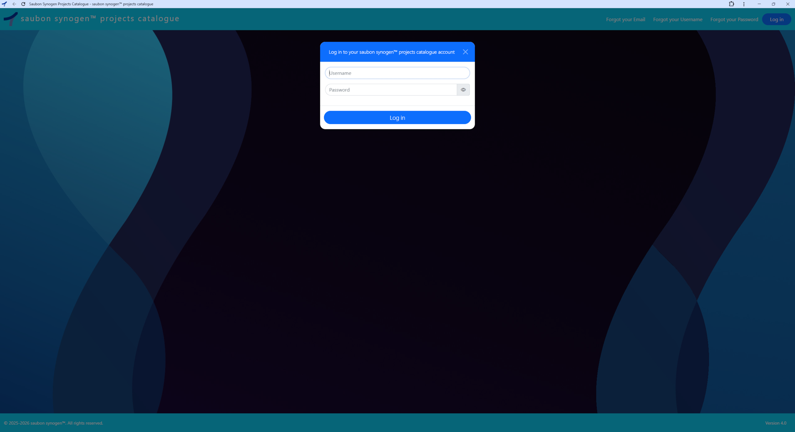
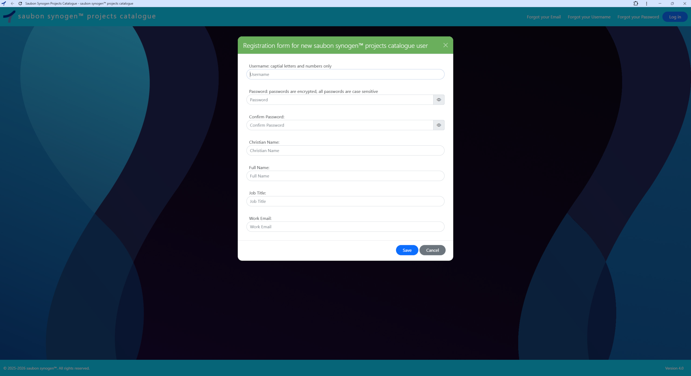
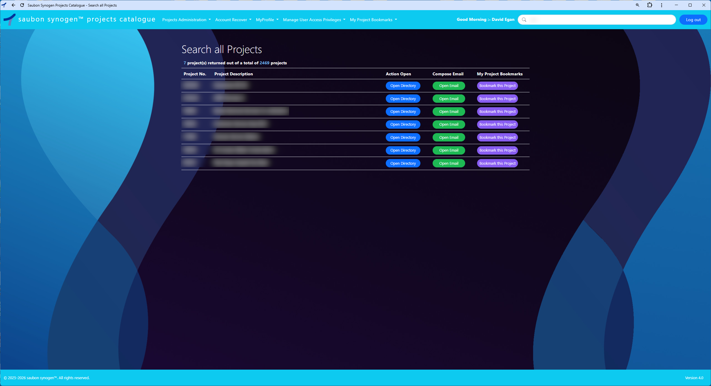
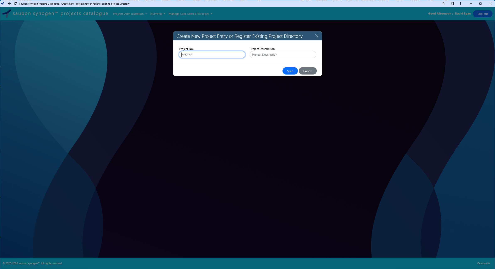
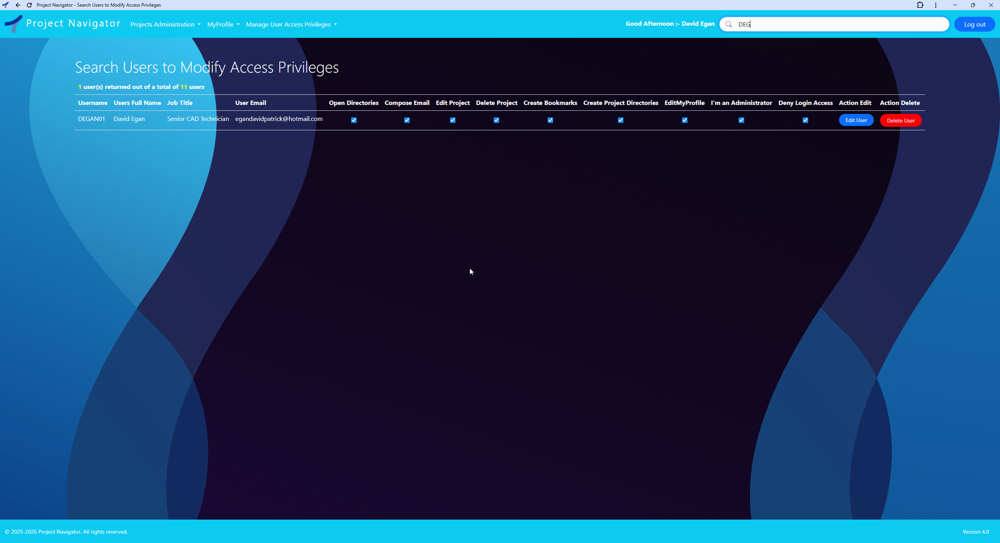

# 🏢 Saubon Synogen™ Multi-User Projects Catalogue Web Application

Centralised engineering project retrieval and data intelligence platform for AEC organisations managing both live and historical project data at scale.

  
> Click the screenshot to view the full-resolution image within the repository.

---

## 🌐 Platform Overview
The Saubon Synogen™ Multi-User Projects Catalogue Platform was originally developed for the AEC (Architecture, Engineering & Construction) industry, where organisations commonly manage projects using structured directory systems similar to the example below.

## Typical Engineering Project Directory Structure

```text
2026 Projects
├── 26G001 The First Project
├── 26G002 The Second Project
├── 26G003 The Third Project
├── 26G010 The Tenth Project
└── 26G100 The Hundredth Project
```


As engineering organisations grow, these directory structures often expand into thousands of project folders distributed across shared network environments, making historical and active project retrieval increasingly difficult, time-consuming, and operationally inefficient.

The Saubon Synogen™ platform centralises both historical and current project information into a structured, searchable catalogue, enabling engineering teams to locate projects and associated information in seconds rather than manually navigating complex directory trees.

The system provides:

* Rapid project retrieval
* Centralised project visibility
* Improved operational continuity
* Increased accessibility to organisational knowledge
* Reduced time spent searching legacy directories
* Enhanced collaboration across engineering teams

While originally developed for AEC operational workflows, the platform architecture is adaptable to other industries that manage projects using similarly structured directory environments, project-number-based folder systems, shared operational directories, or large-scale historical data repositories comparable to the example illustrated above.


---

## ✨Key Features

* Centralised engineering project catalogue
* Fast historical and current project retrieval
* Structured searchable project environment
* Multi-user collaboration workflow
* Operational traceability logging
* Autonomous health monitoring
* Shared live project visibility
* Reduced dependency on fragmented directory structures

---
## 🛠 Tech Stack

Frontend:
- Bootstrap
- jQuery
- JavaScript
- AJAX
  
Backend:
- ClosedXML
- PHP
  
Servers Client & Sevice Background:
- Enola Client Server C# Winforms
- Service Background Server C#
--- 

## 🧩 Architecture

The system uses a dual-mode Enola backend, packaged as a single x64-bit executable with a dedicated installer for automated setup and configuration.

<h3>Enola Client (Visible)</h3>
Asynchronous user-facing server instance responsible for:

- Monitoring: Real-time status and user activity
- Full record unlocking traceability: Tracks who unlocks projects and user_accounts records
- Operational logging: User actions and system events
- Automated health monitoring: Client-side diagnostics
  
<h3>Enola Service (Hidden)</h3>
Asynchronous background server responsible for:

- Background monitoring: Continuous system checks when client is closed
- Failover record unlocking: Assumes Primary Unlocker status on client exit
- Operational logging: Service-level events and errors
- Automated health monitoring: Backend diagnostics
  
Primary Unlocker mechanism: Only one instance holds unlock rights for projects and user_accounts tables at a time. The Visible Client holds Primary Unlocker during active use. On client shutdown or stopping the client server, the Hidden Service automatically takes over.

---

## 📸 Screenshots


<h3>Login & New User Registration</h3>

<p align="left">
  
  
</p>


<h3>Search all Projects & Search Projects to Modify</h3>

<p align="left">
  
  
</p>

<h3>Edit MyProfile & Create New Project Entry</h3>
<p align="left">


</p>

<h3>Search Users to Modify Access Privileges</h3>




<h3>Project in use Notification & User account in use Notification</h3>

<p align="left">
  
  
</p>
> Click any screenshot to view the full-resolution image within the repository.

---

<h3>Enola :- Architectural Diagram - Primary Unlocker Model</h3>


<h3>Enola :- Server is running & Enola :- Server is stopped</h3>

<p align="left">
  
  
</p>


<h3>Enola :- About & Enola :- Server is running</h3>

<p align="left">
  
  
</p>

<h3>Enola :- Server is stopped & Enola :- Only one enola client instance allowed to run</h3>

<p align="left">
  
  
</p>
> Click any screenshot to view the full-resolution image within the repository.

---


## 💡 Solution

The Saubon Synogen™ Multi-User Projects Catalogue centralises both historical and active engineering project data into a structured, searchable environment where information can be located in seconds — eliminating manual directory navigation, wasted time, and unreliable retrieval workflows.

The platform provides a single operational source of truth for project visibility across the organisation, enabling engineering teams to:

* Quickly retrieve historical and current project information
* Maintain workflow continuity across departments and project lifecycles
* Improve coordination and collaboration between teams
* Increase accessibility to organisational knowledge and technical records
* Enhance operational visibility throughout the business
* Reduce time spent searching for engineering documentation and project assets

By consolidating all project information into a unified catalogue system, the solution improves efficiency, strengthens knowledge retention, and supports faster engineering decision-making across the organisation.


---

## 👥 Who Is It For?

Designed for AEC organisations managing multi-user engineering workflows involving:

* Project Managers
* Architects
* Engineers
* CAD Technicians
* Consultants
* Contractors
* Document Controllers

---

## ⚡ Why Is It Better Than Traditional Workflows?

Instead of relying on disconnected directories, emails, spreadsheets, and shared drives, the platform provides a centralised live project environment where all users work from the same current information.

This reduces time spent searching for project directories, improves coordination across teams, and ensures historical and current engineering information remains:

* Accessible
* Traceable
* Structured
* Consistently available

---

## 🏗 Operational Infrastructure

- XAMPP
- Apache 
- MariaDB Database
  
The platform includes integrated Enola Client and Enola Service server components responsible for:

-  Automated unlocking
-  Operational traceability logging
-  Autonomous health monitoring
-  Production environment monitoring
-  Background operational services

---

## 🚀 Live Demo

### Search All Projects — Saubon Synogen™ Project Catalogue Demo

https://youtu.be/6LXpte1vlTI

### Enola Client Server Demo

https://youtu.be/H2ukH4vqn70

---

## 📂 Repository Contents

```text
/guides/install-guides-considerations
  Does Your Company's Projects Directory Structure Align with the Saubon Synogen™ Web Application Workflow (PDF)
  Installation & Deployment (PDF)
  Remote Working (PDF)
  
/guides/user-guides
  Saubon Synogen™ Projects Catalogue User guides (PDF)
  Saubon Synogen™ Enola client server User guide (PDF)

/images/projects-catalogue
  Saubon Synogen™ Projects Catalogue screenshots

/images/enola-server
  Enola client server screenshots

/logs
  Visible logs generated by Enola Client
  Hidden logs generated by Enola Service
```

---

## 📚 Documentation

This repository includes:

* User Guides
* Installation Documentation
* Operational Considerations
* Application Screenshots
* Execution Logs

---

## 📌 Status

✅ Completed Project  

---

## 🤝 Contributing

Pull requests are welcome.

---

## 🧑‍💻 Author

David Egan
Software Engineer & Solutions Architect

Designer and developer of the Saubon Synogen™ Multi-User Projects Catalogue Platform — a centralised engineering project intelligence system developed to improve project visibility, information retrieval, and operational efficiency across AEC engineering environments.

Architect of the Enola Server, Client, and Service infrastructure forming the operational foundation of the Saubon Synogen™ platform.

Lead systems architect and sole software engineer responsible for platform architecture, system design, application development, database architecture, workflow integration, multi-user environment design, and deployment strategy.


