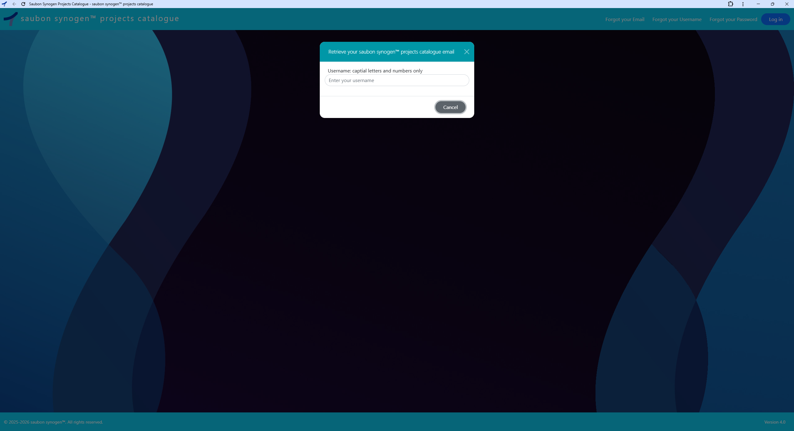
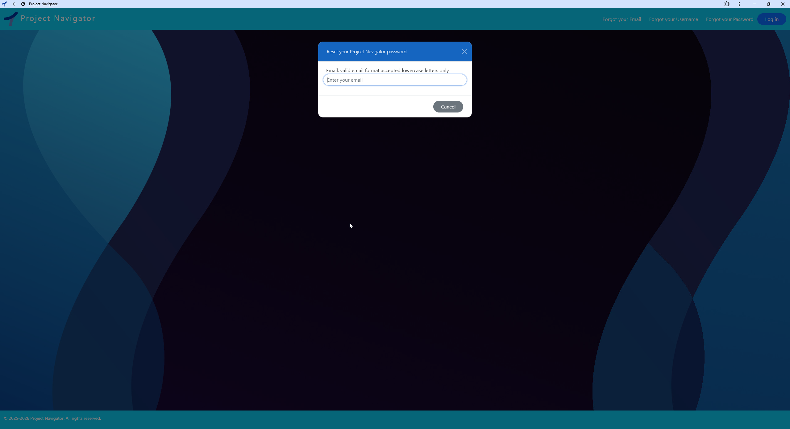
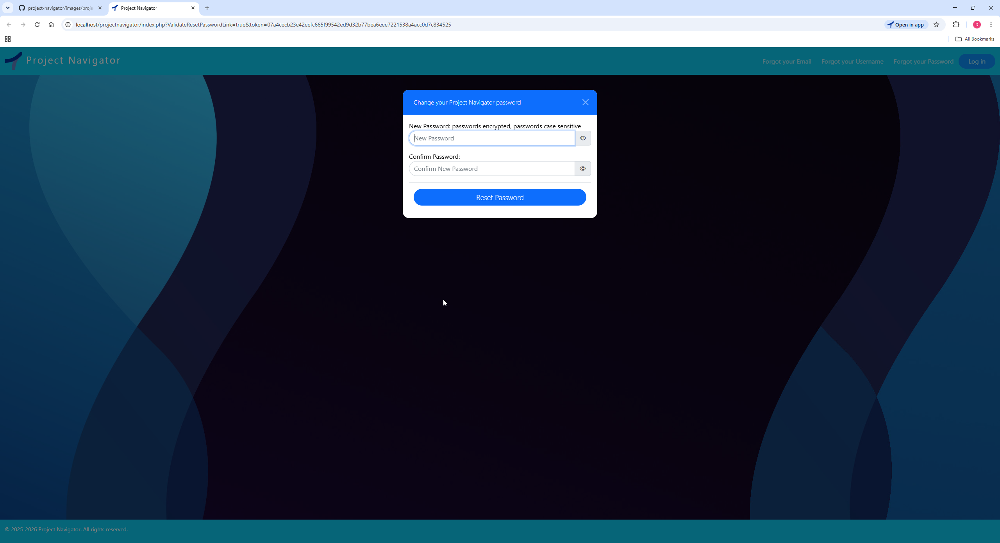

# Saubon Synogen™ Multi-User Projects Catalogue Web Application

  
> Click the screenshot to view the full-resolution image within the repository.

---

## 🌐 Platform Overview
The Saubon Synogen™ Multi-User Projects Catalogue Platform was originally developed for the AEC (Architecture, Engineering & Construction) industry, where organisations commonly manage projects using structured directory systems similar to the examples below.

## Typical Engineering Project Directory Structure

```text
2026 Projects
├── 26G001 The First Project
├── 26G002 The Second Project
├── 26G003 The Third Project
├── 26G010 The Tenth Project
└── 26G100 The Hundredth Project
```
```text
2022 Projects
├── 22ME001 The First Project
├── 22ME002 The Second Project
├── 22ME003 The Third Project
├── 22ME010 The Tenth Project
└── 22ME100 The Hundredth Project
```
```text
2020 Projects
├── 20K001 The First Project
├── 20K002 The Second Project
├── 20K003 The Third Project
├── 20K010 The Tenth Project
└── 20K100 The Hundredth Project
```


As engineering organisations grow, these directory structures often expand into thousands of project directories distributed across shared network environments, making historical and active project retrieval increasingly difficult, time-consuming, and operationally inefficient.

The Saubon Synogen™ platform centralises both historical and current project information into a structured, searchable catalogue. This catalogue can be adapted to point directly to cloud storage locations such as OneDrive or enterprise file servers, enabling engineering teams to locate projects and associated information in seconds rather than manually navigating complex directory trees.

The system provides:

- Rapid project retrieval
- Centralised project visibility
- Improved operational continuity
- Increased accessibility to organisational knowledge
- Reduced time spent searching legacy directories and file systems
- Enhanced collaboration across engineering teams

While originally developed for AEC operational workflows, the platform architecture is adaptable to other industries that manage projects using similarly structured directory environments, project-number-based directory systems, shared operational directories, cloud-hosted file repositories, or large-scale historical data stores comparable to the example directory structures illustrated above.


---

## ✨Key Features

* Centralised engineering project catalogue
* Fast historical and current project retrieval
* Structured searchable project environment
* Multi-user collaboration workflow
* Operational traceability logging
* Autonomous health monitoring
* Shared live project visibility
* Reduced dependency on fragmented directory structures

---
## 🛠 Tech Stack

<h4>Frontend</h4>

- Bootstrap
- jQuery
- JavaScript
- AJAX
- Excel & Email integration Click Once
- HTML5
- CSS3
  
<h4>Backend</h4>

- Excel integration ClosedXML
- PHP

<h4>Servers Client & Sevice Background</h4>

- Enola Client Server C# Winforms
- Service Background Server C#

<h4>Integrated Development Environment</h4>

- Microsoft Visual Studio 2022
  
<h4>Packager-Deployment</h4>

- Microsoft Visual Studio 2022 Installer Projects
--- 
# Does your workflow fit the Projects Catalogue way of working?

If your company’s directory structure aligns with the sample directory structures defined above, the Saubon Synogenn™ Projects Catalogue web application can be used to manage and coordinate the project directory workflow throughout your organisation.

--- 

# Saubon Synogen™ and Enola Deployment Architecture

The Saubon Synogen system consists of approximately 65 PHP scripts that collectively define the Saubon Synogen web application. This application represents the user-facing side of the system and is the primary interface through which users interact with the platform.

Enola, by contrast, functions as the backend service layer of the overall system architecture.

The intended deployment model for both Saubon Synogen and Enola is an on-premises company file server environment. All application data is stored locally within the company infrastructure rather than in external cloud services.

The deployment stack is based on XAMPP, which provides the core runtime environment, including:

* Apache as the web server
* PHP as the application runtime
* MariaDB as the database server

Typically, the Saubon Synogen web application is deployed under Apache within the XAMPP environment.

MariaDB hosts the application databases and tables, including:

* The `projects` database and corresponding `projects` table
* The `accounts` database and corresponding `user_accounts` table

Enola is designed to operate as a continuously running backend service. Its primary responsibility is to connect to the MariaDB server and monitor both the `projects` and `user_accounts` tables for locked records.

Enola polls these tables approximately once per second. If locked records are detected, Enola evaluates the age of the lock. Any record that has remained locked for five minutes or longer is automatically unlocked by Enola.

This automatic unlocking process applies to both:

* project records within the `projects` table
* user account records within the `user_accounts` table

The purpose of this mechanism is to prevent stale or abandoned record locks from persisting indefinitely, thereby maintaining record accessibility and operational continuity for users of the Saubon Synogen application.

Once deployed, the system operates autonomously.

--- 
## 🧩 Enola Architecture

The system uses a dual-mode Enola backend, packaged as a single x64-bit executable with a dedicated installer for automated setup and configuration.

<h3>Enola Client (Visible)</h3>
Asynchronous user-facing server instance responsible for:

- Monitoring: Real-time status and user activity
- Full record unlocking traceability: Tracks who unlocks projects and user_accounts records
- Operational logging: User actions and system events
- Automated health monitoring: Client-side diagnostics
  
<h3>Enola Service (Hidden)</h3>
Asynchronous background server responsible for:

- Background monitoring: Continuous system checks when client is closed or stopping the client server
- Takeover record unlocking: Becomes Primary Unlocker status on client exit or stopping the client server
- Full record unlocking traceability: Tracks who unlocks projects and user_accounts records
- Operational logging: Service-level events and errors
- Automated health monitoring: Backend diagnostics
  
Primary Unlocker mechanism: Only one instance holds unlock rights for projects and user_accounts tables at a time. The Visible Client holds Primary Unlocker during active use. On client shutdown or stopping the client server, the Hidden Service automatically takes over.

---
## Enola: Self-Healing Locks — No Human Intervention Required

### Test: Dual Browsers Crash Recovery
**Scenario:** A user edits records in two browser sessions. Both browser processes are forcefully terminated via Task Manager.

**Failure Condition Without Recovery:** Records remain locked indefinitely, requiring administrator intervention.

**Enola Result:** All locks were automatically released within 5 minutes. No support tickets or manual admin actions were required.

**Demo:** [Enola Self-Healing Locks](https://youtu.be/5InjDMPG5qw)

**Watch the system tray clock in the video**

- The video pauses at 15:18 and resumes at 15:23.
- The locks are gone. The service removed them with no human intervention.

---

## 📸 Screenshots


<h3>Login & New User Registration</h3>

<p align="left">
  
  
</p>

<h3>Account Recovery Email Retrieval & Username Retrieval</h3>

<p align="left">
  
  
</p>

<h3>Account Recovery Reset Password & Change Password</h3>

<p align="left">
  
  
</p>


<h3>Search all Projects & Search Projects to Modify</h3>

<p align="left">
  
  
</p>

<h3>Edit MyProfile & Create New Project Entry</h3>
<p align="left">


</p>

<h3>Search Users to Modify Access Privileges</h3>


<h3>Project in use Notification & User account in use Notification</h3>

<p align="left">
  
  
</p>
> Click any screenshot to view the full-resolution image within the repository.

---

<h3>Enola :- Architectural Diagram - Primary Unlocker Model</h3>


<h3>Enola :- Server is running & Enola :- Server is stopped</h3>

<p align="left">
  
  
</p>


<h3>Enola :- About & Enola :- Server is running</h3>

<p align="left">
  
  
</p>

<h3>Enola :- Server is stopped & Enola :- Only one enola client instance allowed to run</h3>

<p align="left">
  
  
</p>
> Click any screenshot to view the full-resolution image within the repository.

---


## 💡 Solution

The Saubon Synogen™ Multi-User Projects Catalogue centralises both historical and active engineering project data into a structured, searchable environment where information can be located in seconds — eliminating manual directory navigation, wasted time, and unreliable retrieval workflows.

The platform provides a single operational source of truth for project visibility across the organisation, enabling engineering teams to:

* Quickly retrieve historical and current project information
* Maintain workflow continuity across departments and project lifecycles
* Improve coordination and collaboration between teams
* Increase accessibility to organisational knowledge and technical records
* Enhance operational visibility throughout the business
* Reduce time spent searching for engineering documentation and project assets

By consolidating all project information into a unified catalogue system, the solution improves efficiency, strengthens knowledge retention, and supports faster engineering decision-making across the organisation.


---

## 👥 Who Is It For?

Designed for AEC organisations managing multi-user engineering workflows involving:

* Project Managers
* Architects
* Engineers
* CAD Technicians
* Consultants
* Contractors
* Document Controllers

---

## ⚡ Why Is It Better Than Traditional Workflows?

Instead of relying on disconnected directories, emails, spreadsheets, and shared drives, the platform provides a centralised live project environment where all users work from the same current information.

This reduces time spent searching for project directories, improves coordination across teams, and ensures historical and current engineering information remains:

* Accessible
* Traceable
* Structured
* Consistently available

---

## 🏗 Operational Infrastructure

- XAMPP
- Apache 
- MariaDB Database
  
The platform includes integrated Enola Client and Enola Service server components responsible for:

-  Automated unlocking
-  Operational traceability logging
-  Autonomous health monitoring
-  Production environment monitoring
-  Background operational services

---

## 🚀 Live Demo

[Search All Projects — Saubon Synogen™ Project Catalogue Demo](https://youtu.be/6LXpte1vlTI)

[Enola Client Server Demo](https://youtu.be/H2ukH4vqn70)

---

## 📂 Repository Contents

```text
/guides/install-guides-considerations
  Does Your Company's Projects Directory Structure Align with the Saubon Synogen™ Web Application Workflow (PDF)
  Installation & Deployment (PDF)
  Remote Working (PDF)
  
/guides/user-guides
  Saubon Synogen™ Projects Catalogue User guides (PDF)
  Saubon Synogen™ Enola client server User guide (PDF)

/images/projects-catalogue
  Saubon Synogen™ Projects Catalogue screenshots

/images/enola-server
  Enola client server screenshots

/logs
  Visible logs generated by Enola Client
  Hidden logs generated by Enola Service
```

---

## 📚 Documentation

This repository includes:

* User Guides
* Installation Documentation
* Operational Considerations
* Application Screenshots
* Execution Logs

---

## 📌 Status

✅ Completed Project  

---

## 🧑‍💻 Author

David Egan

Sole Software Developer & Solutions Architect of the Saubon Synogen™ Multi-User Projects Catalogue Platform

<a href="https://www.linkedin.com/in/davidpatrickegan">LinkedIn</a> • [GitHub](https://github.com/egandavidpatrick-del/saubon-synogen)
