<a id="enterprise-project-navigator"></a>


##  Enterprise Project Navigator
A multi-user engineering project drectory management platform built with PHP, C#, MariaDB and JavaScript.
<p align="left">
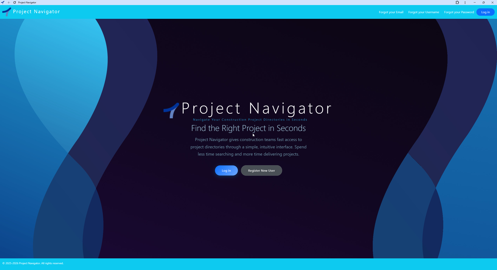
</p>
> Click the screenshot to view the full-resolution image within this repository.

---

## 🧭 Explore the Project

| 📖 Overview | 🛠️ Technical | 📚 Resources | 📈 Project |
|:-----------:|:------------:|:------------:|:----------:|
| 🌐 [Platform Overview](#platform-overview) | ✨ [Key Features](#key-features) | 📦 [Contents](#repository-contents) | 📊 [Results](#results) |
| 📁 [Directory Structure](#typical-engineering-project-directory-structure) | 🛠️ [Tech Stack](#tech-stack) | 📚 [Documentation](#documentation) | 🚦 [Project Status](#project-status) |
| 💡 [Solution](#solution) | 🏗️ [Enola Architecture](#enola-architecture) | 🖼️ [Screenshots](#screenshots-project-navigator--enola) | 👤 [Author](#author) |
| 👥 [Who Is It For](#who-is-it-for) | ⚙️ [Infrastructure](#operational-infrastructure) | 🔴 [Live Demo](#live-demo) | |
| 🚀 [Why It's Better](#why-is-it-better-than-traditional-workflows) | | | |

---

<a id="platform-overview"></a>
## 🌐 Platform Overview
The Multi-User Project Navigator Platform was originally developed for the AEC (Architecture, Engineering & Construction) industry, where organisations commonly manage projects using structured directory systems similar to the examples below.
<a id="typical-engineering-project-directory-structure"></a>
## 📁 Typical Engineering Project Directory Structure

```text
2026 Projects
├── 26G001 The First Project
├── 26G002 The Second Project
├── 26G003 The Third Project
├── 26G010 The Tenth Project
└── 26G100 The Hundredth Project
```
```text
2022 Projects
├── 22ME001 The First Project
├── 22ME002 The Second Project
├── 22ME003 The Third Project
├── 22ME010 The Tenth Project
└── 22ME100 The Hundredth Project
```
```text
2020 Projects
├── 20L001 The First Project
├── 20L002 The Second Project
├── 20L003 The Third Project
├── 20L010 The Tenth Project
└── 20L100 The Hundredth Project
```


As engineering organisations grow, these directory structures often expand into thousands of project directories distributed across shared network environments, making historical and active project retrieval increasingly difficult, time-consuming, and operationally inefficient.

The Navigator platform centralises both historical and current project information into a structured, searchable catalogue. This catalogue can be adapted to point directly to cloud storage locations such as OneDrive or enterprise file servers, enabling engineering teams to locate projects and associated information in seconds rather than manually navigating complex directory trees.

The system provides:

- Rapid project retrieval
- Centralised project visibility
- Improved operational continuity
- Increased accessibility to organisational knowledge
- Reduced time spent searching legacy directories and file systems
- Enhanced collaboration across engineering teams

While the platform was originally developed for the AEC (Architecture, Engineering & Construction) sector, its underlying architecture is designed to support any industry in which organisations manage projects through structured directory hierarchies. This includes environments that rely on project-number-based directory systems, shared operational directories, cloud-based file repositories, or extensive historical data archives similar to the example project directory structures illustrated above.


---
<a id="repository-contents"></a>
## 📦 Repository Contents

```text
/guides/install-guides-considerations
  Does Your Company's Projects Directory Structure Align with the Navigator Web Application Workflow (PDF)
  Installation & Deployment (PDF)
  Remote Working (PDF)
  
/guides/user-guides
  Project Navigator User guides (PDF)
  Enola client server User guide (PDF)

/images/project-navigator
  Project Navigator screenshots

/images/enola-server
  Enola client server screenshots

/logs
  Visible logs generated by Enola Client
  Hidden logs generated by Enola Service
```

---
<a id="documentation"></a>
## 📚 Documentation

This repository includes:

* User Guides
* Installation Documentation
* Operational Considerations
* Application Screenshots
* Execution Logs

---
[Back to top](#enterprise-project-navigator)
<a id="key-features"></a>
## ✨Key Features

- Centralised engineering project catalogue
- Fast historical and current project retrieval
- Structured searchable project environment
- Multi-user access and administration
- Shared project visibility
- Project bookmarking and quick access
- Controlled project lifecycle management (CRUD)
- Reduced dependency on fragmented directory structures
- Automated system health monitoring

---
<a id="tech-stack"></a>
## 🛠 Tech Stack

<h4>Frontend</h4>

- Bootstrap
- jQuery
- Vue -> Enola Record Unlock Viewer
- JavaScript
- AJAX
- HTML5
- CSS3
  
<h4>Backend</h4>

- PHP

<h4>Servers Client & Sevice Background</h4>

- Enola Client Server C# Winforms
- Enola Service Server C#

<h4>Integrated Development Environment</h4>

- Microsoft Visual Studio 2022
  
<h4>Packager-Deployment</h4>

- Microsoft Visual Studio 2022 Installer Projects
--- 
## Does your workflow fit the Project Navigator way of working?

If your company’s directory structure aligns with the sample directory structures defined above, the Project Navigator web application can be adapted and used to manage and coordinate the project directory workflow throughout your organisation.

--- 

## The Origins of Enola

My association with the name Enola has no connection to the software industry or computing field. My familiarity with the name comes from the Navajo people of Arizona, where I understood Enola to be a name given to a baby girl, carrying the meaning “Magnolia.” Any reference I make to Enola relates to that cultural and personal context, not to any technology company, software product, or computing-related subject.

--- 

## Project Navigator and Enola Deployment Architecture

The Navigator system consists of approximately 65 PHP scripts that collectively define the Navigator web application. This application represents the user-facing side of the system and is the primary interface through which users interact with the platform.

Enola, by contrast, functions as the backend service layer of the overall system architecture.

The intended deployment model for both Navigator and Enola is an on-premises company file server environment. All application data is stored locally within the company infrastructure rather than in external cloud services.

The deployment stack is based on XAMPP, which provides the core runtime environment, including:

* Apache as the web server
* PHP as the application runtime
* MariaDB as the database server

Typically, the Navigator web application is deployed under Apache within the XAMPP environment.

MariaDB hosts the application databases and tables, including:

* The `projects` database and corresponding `projects` table
* The `accounts` database and corresponding `user_accounts` table

Enola is designed to operate as a continuously running backend service. Its primary responsibility is to connect to the MariaDB server and monitor both the `projects` and `user_accounts` tables for locked records.

Enola polls these tables approximately once per second. If locked records are detected, Enola evaluates the age of the lock. Any record that has remained locked for five minutes or longer is automatically unlocked by Enola.

This automatic unlocking process applies to both:

* project records within the `projects` table
* user account records within the `user_accounts` table

The purpose of this mechanism is to prevent stale or abandoned record locks from persisting indefinitely, thereby maintaining record accessibility and operational continuity for users of the Project Navigator application.

Once deployed, the system operates autonomously.

--- 
[Back to top](#enterprise-project-navigator)
<a id="enola-architecture"></a>
## 🏗️ Enola Architecture

The system uses a dual-mode Enola backend, packaged as a single x64-bit executable with a dedicated installer for automated setup and configuration.

<h3>Enola Client (Visible)</h3>
Asynchronous user-facing server instance responsible for:

- Monitoring: Real-time status and user activity
- Full record unlocking traceability: Tracks who unlocks projects and user_accounts records
- Operational logging: User actions and system events
- Automated health monitoring: Client-side diagnostics
  
<h3>Enola Service (Hidden)</h3>
Asynchronous background server responsible for:

- Background monitoring: Continuous system checks when client is closed or stopping the client server
- Takeover record unlocking: Becomes Primary Unlocker status on client exit or stopping the client server
- Full record unlocking traceability: Tracks who unlocks projects and user_accounts records
- Operational logging: Service-level events and errors
- Automated health monitoring: Backend diagnostics
  
Primary Unlocker mechanism: Only one instance holds unlock rights for projects and user_accounts tables at a time. The Visible Client holds Primary Unlocker during active use. On client shutdown or stopping the client server, the Hidden Service automatically takes over. When the computer boots up the Hidden Service by default it the Primary Unlocker.

---
## Enola: Self-Healing Stale Locks Automatic Recovery — No Human Intervention Required

### Test: Dual Browsers Crash Recovery
**Scenario:** A user edits records in two browser sessions. Both browser processes are forcefully terminated via Task Manager.

**Failure Condition Without Recovery:** Records remain locked indefinitely, requiring administrator intervention.

**Enola Result:** All stale locks were automatically released exactly within 5 minutes. No support tickets or manual admin actions were required.

**Demo:** [Enola Self-Healing Stale Locks Automatic Recovery Demo](https://youtu.be/0zkPsoY0_ps)

**Watch the system tray clock on the taskbar in the video**

- The video pauses at 12:25:23 and resumes at 12:29:24. The pause is to allow 4 minutes to elapse before unlocking.
- The stale locks are gone. The Enola service removed them automatically with no human intervention.
- As shown in the video, the log file is automatically generated by the Enola Service and appears in the Logs directory within File Explorer. The log file’s properties show the creation date and time and last modified date and time, confirming that the unlock operations were executed in real time.
- View the image at the end of this section to see the log file as created in the video as seen in the Enola Record Unlock Viewer.

  For a full breakdown of Enola and associated visible/hidden log files and PID naming check the Enola User Guide in the /guides/user-guides folder in this repository.

<h3>Enola Record Unlock Viewer</h3>

**The log file as created in the video as seen in the Enola Record Unlock Viewer**

<p align="left">
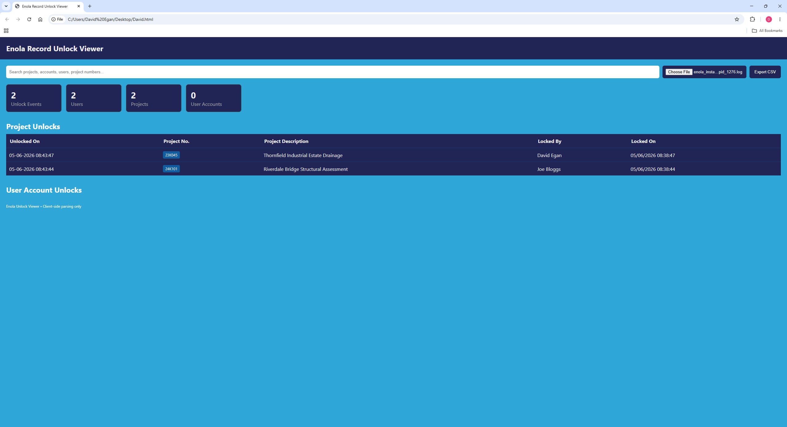
</p>
> Click the screenshot to view the full-resolution image within this repository.

---
[Back to top](#enterprise-project-navigator)
<a id="screenshots-project-navigator--enola"></a>
## 🖼️ Screenshots Project Navigator & Enola


<h3>Login & New User Registration</h3>

<p align="left">
  
  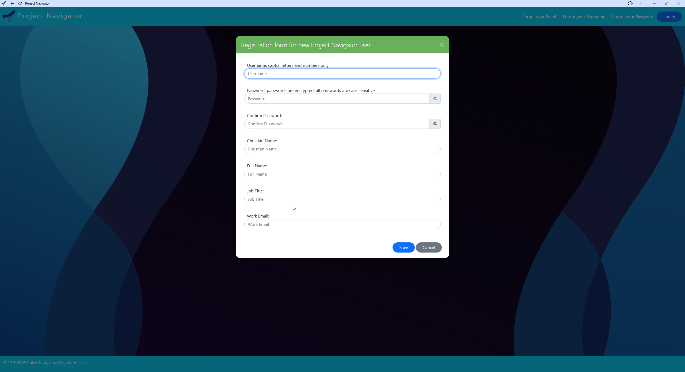
</p>

<h3>Account Recovery Email Retrieval & Username Retrieval</h3>

<p align="left">
  
  
</p>

<h3>Account Recovery Reset Password & Change Password</h3>

<p align="left">
  
  
</p>


<h3>Search all Projects & Search Projects to Modify</h3>

<p align="left">
  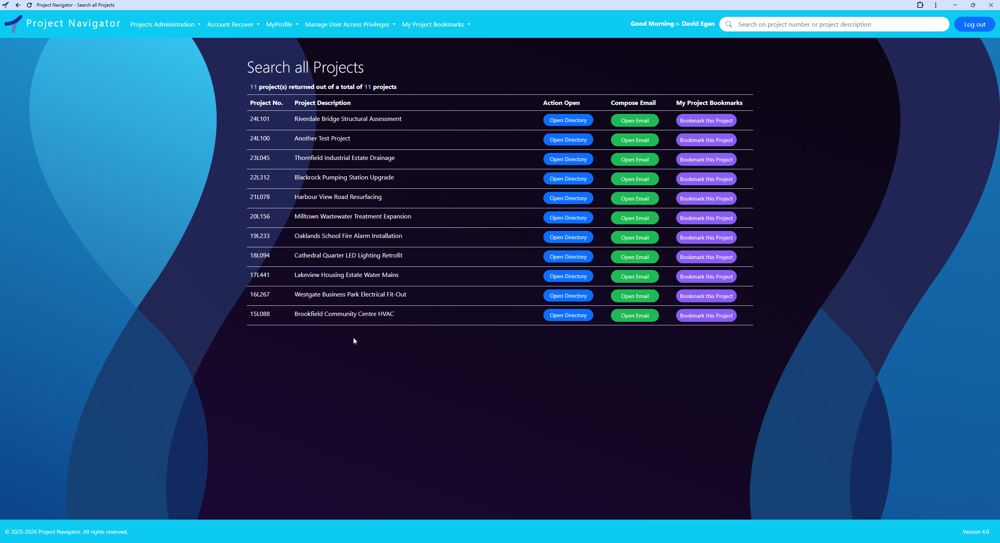
  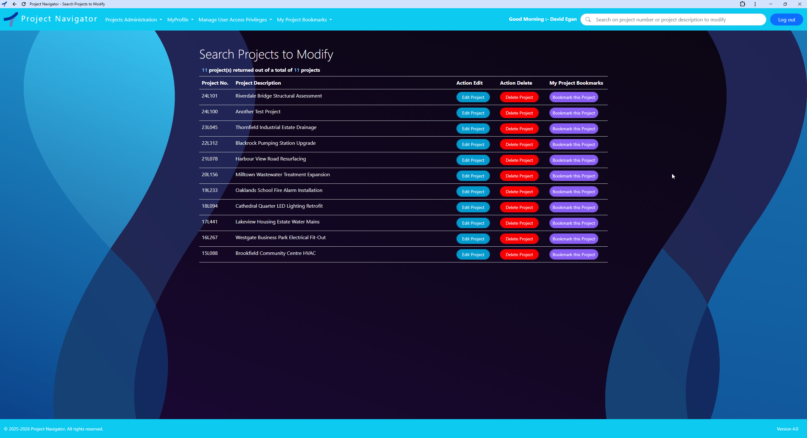
</p>

<h3>Edit MyProfile & Create New Project Entry</h3>
<p align="left">
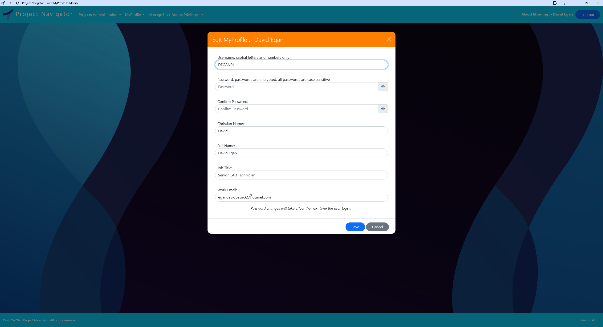
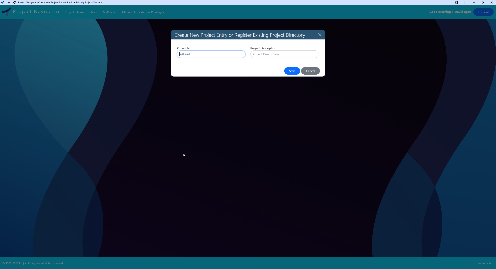
</p>

<h3>Search Users to Modify Access Privileges & Grant/Revoke User Privileges</h3>
<p align="left">

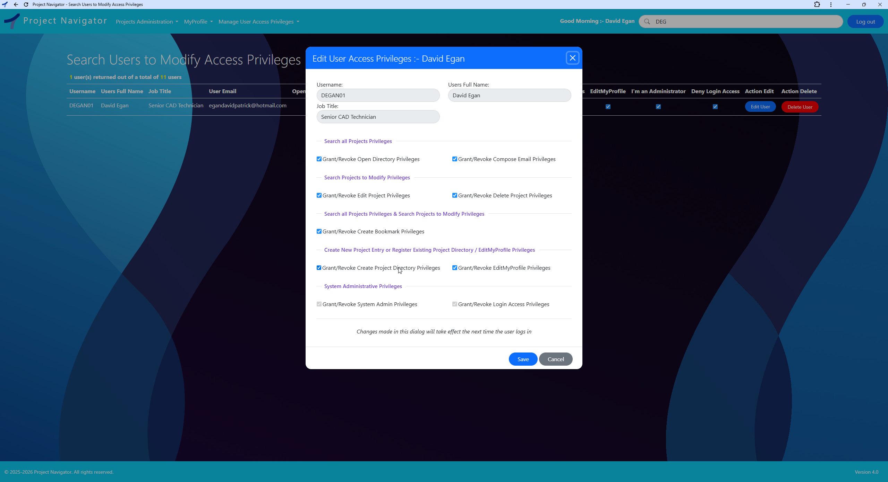
</p>

<h3>Project in use Notification & User account in use Notification</h3>

<p align="left">
  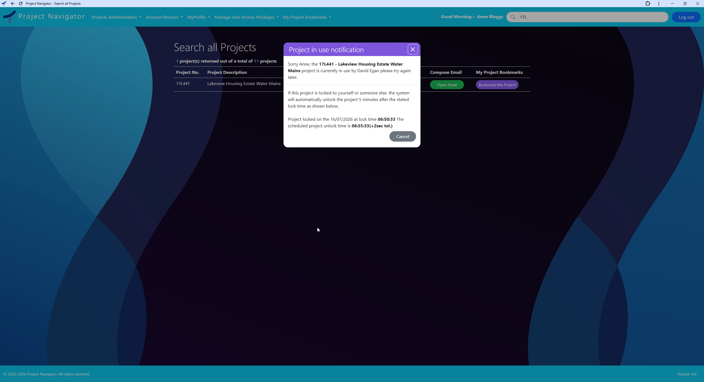
  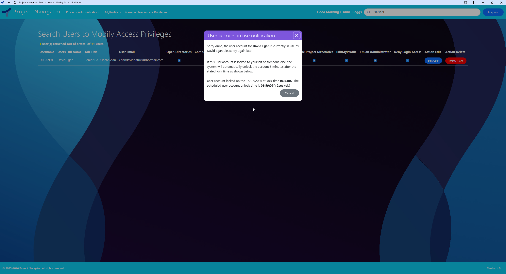
</p>
> Click any screenshot to view the full-resolution image within this repository.

---

<h3>Enola :- Architectural Diagram - Primary Unlocker Model</h3>

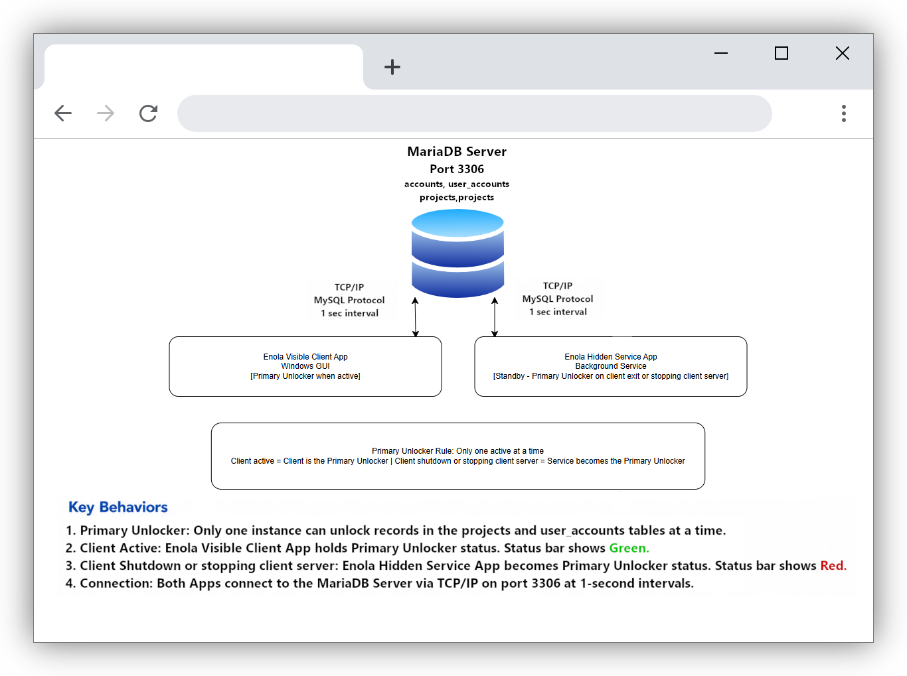

<h3>Enola :- Server is running & Enola :- Server is stopped</h3>

<p align="left">
  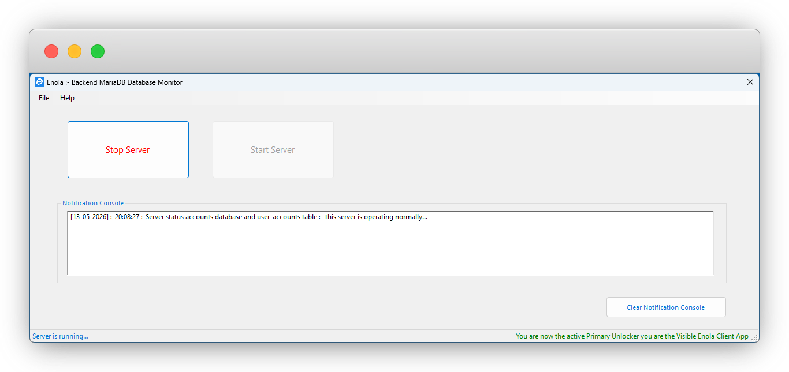
  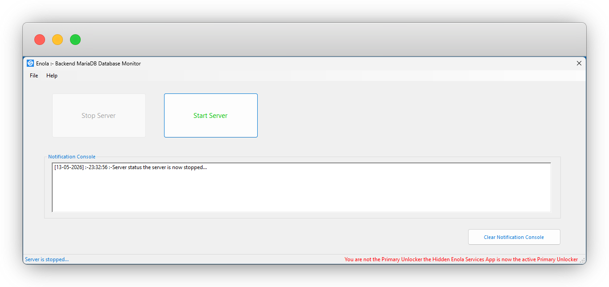
</p>


<h3>Enola :- About & Enola :- Server is running</h3>

<p align="left">
  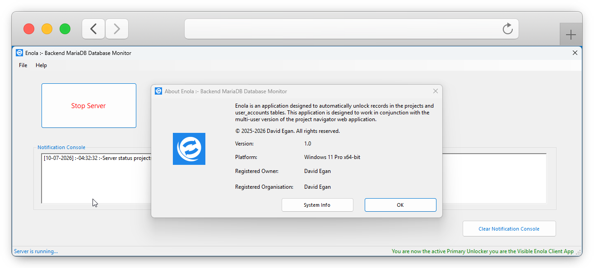
  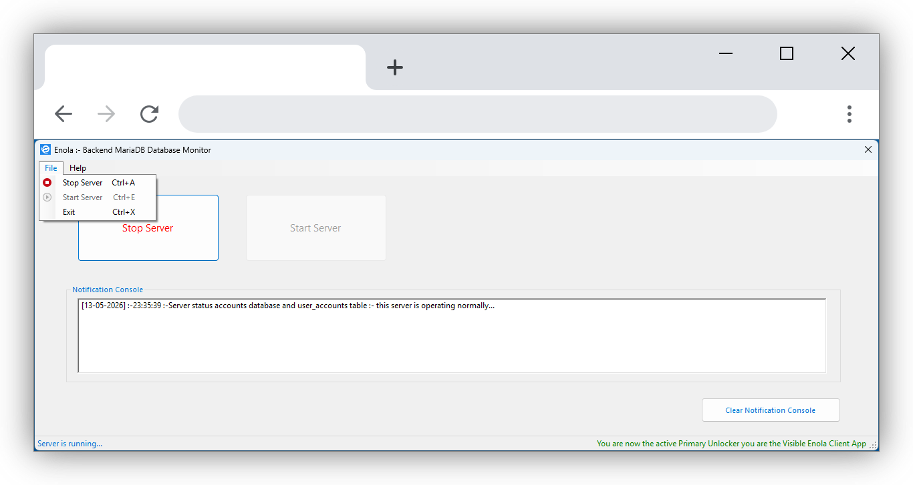
</p>

<h3>Enola :- Server is stopped & Enola :- Only one enola client instance allowed to run</h3>

<p align="left">
  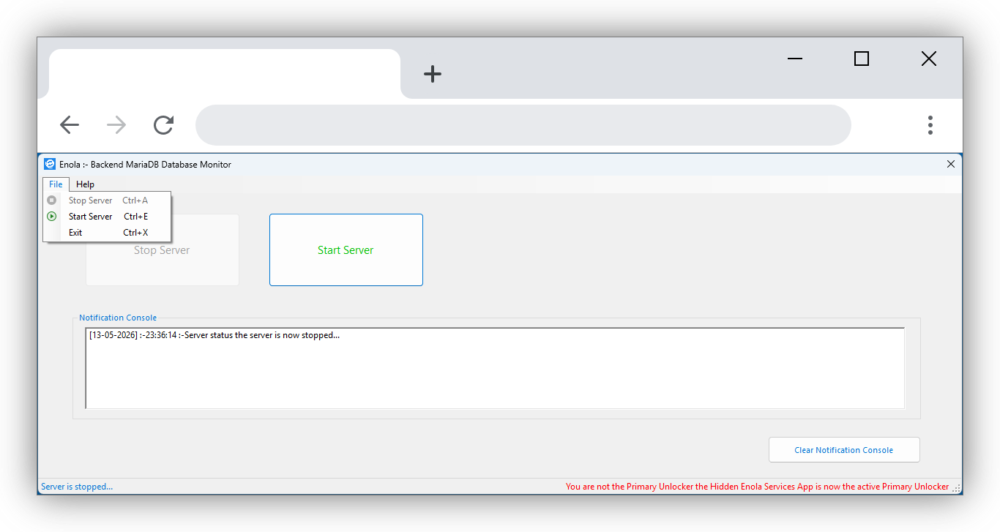
  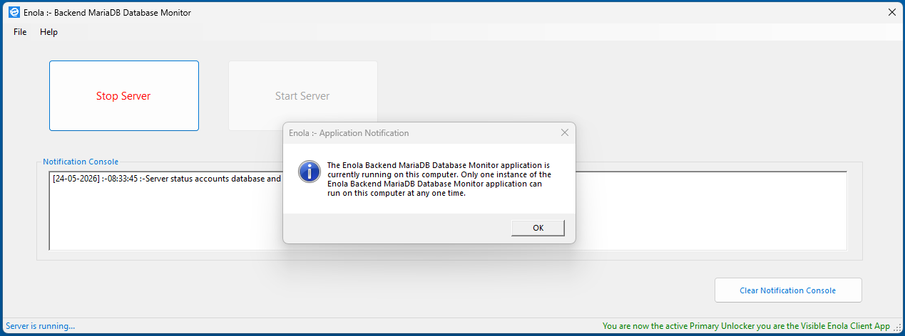
</p>
> Click any screenshot to view the full-resolution image within this repository.

---


<a id="solution"></a>
[Back to top](#enterprise-project-navigator)
## 💡 Solution

The Multi-User Project Navigator centralises historical and active engineering project information into a structured, searchable environment where project records can be located in seconds—eliminating manual directory navigation, reducing search time, and improving access to engineering knowledge.

The platform provides a shared catalogue of project information across the organisation, enabling engineering teams to:

- Quickly retrieve historical and current project records
- Access project information through a structured search environment
- Improve visibility of engineering projects across departments
- Increase accessibility to organisational knowledge and technical records
- Reduce time spent locating engineering documentation and project assets
- Maintain consistent project information throughout the project lifecycle
- Bookmark and quickly access frequently used projects

By consolidating project information into a unified catalogue system, the solution improves efficiency, strengthens knowledge retention, and supports faster access to the information required for engineering decision-making.


---
<a id="who-is-it-for"></a>
## 👥 Who Is It For?

Designed for AEC organisations managing multi-user engineering workflows involving:

* Project Managers
* Architects
* Engineers
* BIM Information Managers
* BIM Coordinators
* BIM Technicians
* CAD Technicians
* Consultants
* Contractors
* Document Controllers

---
<a id="why-is-it-better-than-traditional-workflows"></a>
## 🚀 Why Is It Better Than Traditional Workflows?

Instead of relying on disconnected directories, emails, spreadsheets, and local copies, the platform provides a centralised network-accessible project catalogue where all users operate from the same shared directory structure and project data.

This reduces time spent searching for project directories, improves coordination across teams, and ensures engineering information remains:

- Accessible
- Structured
- Consistently available
- Shared across all users

---

<a id="operational-infrastructure"></a>
## ⚙️ Operational Infrastructure

**Development and Test Environment**

The Navigator platform was developed and tested on a workstation running Windows 11 Pro. All application components, build processes, database operations, and local deployment activities were validated within this operating system environment. Although the platform is expected to be compatible with other operating systems, formal development and testing were conducted exclusively on Windows 11 Pro.

The hardware specification presented below reflects the development machine used throughout the project lifecycle. These specifications should not be interpreted as minimum system requirements; the platform is not resource-intensive and is expected to operate effectively on systems with lower hardware specifications than those listed.

**Development Environment**
- Operating System: Windows 11 Pro
- Operating System Version: 25H2
- Processor	13th Gen Intel(R) Core(TM) i9-13900 (2.00 GHz)
- Installed RAM	32.0 GB (31.6 GB usable)
- Graphics card	Intel(R) UHD Graphics 770 (128 MB)
- Storage	1TB SSD
- Display 2560 × 1440 resolution
- System type	64-bit operating system, x64-based processor

**Minimum Requirements**

-	Operating System: Windows 11 Pro
-	Installed RAM 8 GB
-	Display 1366×768 resolution
-	Storage 50 MB free space
-	System type 64-bit operating system, x64-based processor


**Software Requirements**
- XAMPP
- Apache 
- MariaDB Database
  
**Network Requirements**
- Internet connection

---

<a id="live-demo"></a>
## 🔴 Live Demo

[Project Navigator Search all Projects Demo](https://youtu.be/crx4kofT_w0)

[Enola Asynchronous Record Unlocking Client Demo](https://youtu.be/zlRKcuggKOM)

---
<a id="results"></a>
## 📊 Results

* Supports concurrent users
* Full administrator portal
* Secure authentication
* Email recovery
* Background monitoring service
* Automated stale record unlocking
* Production-ready architecture

[Back to top](#enterprise-project-navigator)
<a id="project-status"></a>
## 🚦 Project Status

✅ Completed Project  

---
<a id="author"></a>
## 👤 Author

David Egan

Sole Software Developer, Systems Designer, and Solutions Architect for the Enterprise Project Navigator Platform

<a href="https://www.linkedin.com/in/davidpatrickegan">LinkedIn</a> • [GitHub](https://github.com/egandavidpatrick-del/project-navigator)
