#  Multi-User Project Navigator

<b>On-premises multi-user project directory management for AEC organisations</b>

Project Navigator provides a centralised, searchable catalogue of thousands of engineering and construction project directories.

Built with <b>PHP, MariaDB, JavaScript and C#,</b> the platform provides authentication, role-based access, project management and concurrent multi-user access.

Its companion <b>Enola</b> service provides autonomous stale-record recovery and primary/backup failover so abandoned browser sessions don't leave records permanently locked.

<b>Source code is private</b> because the production system was developed for an internal company environment. This repository provides the public architecture, documentation, screenshots and demonstrations.

The problem

AEC organisations can accumulate thousands of project directories across shared network storage.

Finding a historical project can mean navigating:
```text
Projects
 └── Year
     └── Project Number
         └── Project
             └── WIP / Shared / Published / Archive
```
## At a Glance

✔ Full-stack enterprise web application
✔ Secure authentication and authorisation
✔ Modern user interface
✔ Role-based access control
✔ Comprehensive documentation

# 🧭 Multi-User Project Navigator
<h3>Find Project Directories in Seconds</h3> 

---


<i>Project Navigator directory management platform enabling AEC teams to traverse thousands of historical and active project directories in seconds.</i>
<p align="left">
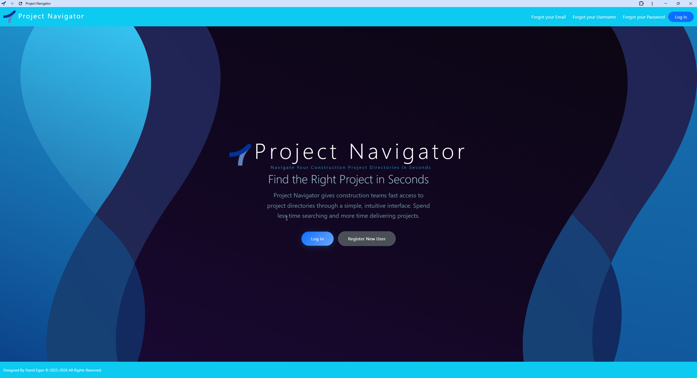
</p>
💡 **Tip:** Click the hero image to view the full-size version.

---

## The interesting part: Enola

Navigator uses optimistic record locking to prevent conflicting edits. Because browser sessions can terminate unexpectedly, locks can become orphaned.

<b>Enola is a C# Windows client paired with a hidden Windows Service designed to recover those locks automatically.</b>

- Continuously monitors locked records
- Detects stale locks
- Automatically releases locks after the configured timeout
- Maintains audit/logging information
- Uses a primary/backup unlocker model
- Continues operating when the visible client is stopped

<h3>Enola :- Architectural Diagram - Primary Unlocker Model</h3>

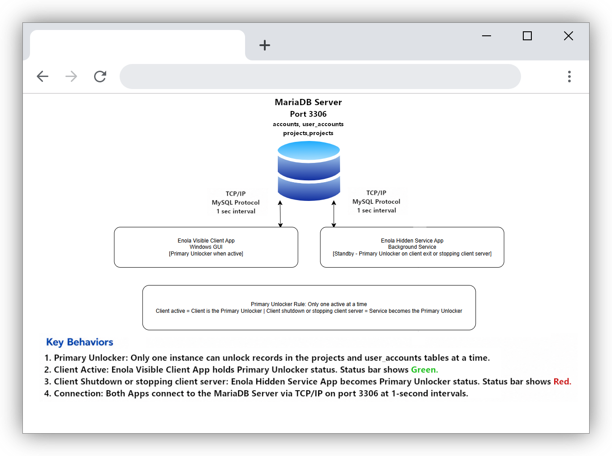

<a id="enterprise-project"></a>

## 📑 Table of Contents

| 📖 Overview | 🛠️ Technical | 📚 Resources | 📈 About |
|:-----------:|:------------:|:------------:|:----------:|
| 🌐 [Platform Overview](#platform-overview) | ✨ [Key Features](#key-features) | 📦 [Contents](#repository-contents) | 📊 [Results](#results) |
| 📁 [Directory Structure](#typical-engineering-project-directory-structure) | 🛠️ [Tech Stack](#tech-stack) | 📚 [Documentation](#documentation) | 🚦 [Project Status](#project-status) |
| 💡 [Solution](#solution) | 🏗️ [Enola Architecture](#enola-architecture) | 🖼️ [Screenshots](#screenshots-project-navigator--enola) | 👤 [Author](#author) |
| 👥 [Who Is It For](#who-is-it-for) | ⚙️ [Infrastructure](#operational-infrastructure) | 🔴 [Live Demo](#live-demo) | |
| 🚀 [Why It's Better](#why-is-it-better-than-traditional-workflows) | | | |


---
[Back to top](#enterprise-project)
<a id="platform-overview"></a>
## 🌐 Platform Overview
The Project Navigator Platform was originally developed for the AEC (Architecture, Engineering & Construction) industry, where organisations commonly manage projects using structured directory systems similar to the examples below.

[Back to top](#enterprise-project)
<a id="typical-engineering-project-directory-structure"></a>

## BIM ISO 19650 Directory Structure
```text
P:\2026 Projects
└── [26L001 PROJECT NAME]
    ├── 00_README.txt
    ├── 01_WIP
    ├── 02_SHARED
    ├── 03_PUBLISHED
    ├── 04_ARCHIVE
    ├── 05_RESOURCES
    └── 06_INCOMING
```
Navigator is designed around structured AEC project directories inspired by ISO 19650 workflows. See the [ /guides/user-guides] for the full structure.

---
[Back to top](#enterprise-project)
<a id="repository-contents"></a>
## 📦 Repository Contents

```text
/guides/install-guides-considerations
  Does Your Company's Projects Directory Structure Align with the Navigator Web Application Workflow (PDF)
  Installation & Deployment (PDF)
  Remote Working (PDF)
  
/guides/user-guides
  Project Navigator User guides (PDF)
  Enola client server User guide (PDF)
  iso-19650-directory-model

/images/project-navigator
  Project Navigator screenshots

/images/enola-server
  Enola client server screenshots

/logs
  Visible logs generated by Enola Client
  Hidden logs generated by Enola Service
```

---
[Back to top](#enterprise-project)
<a id="documentation"></a>
## 📚 Documentation

This repository includes:

* User Guides
* Installation Documentation
* Operational Considerations
* Application Screenshots
* Execution Logs

---
[Back to top](#enterprise-project)
<a id="key-features"></a>
## ✨Key Features

- Project Search — Quickly find projects by structured metadata.
- Project Management — Create, edit, and manage project records.
- Directory Navigation — Open project locations directly from Navigator.
- Multi-User Access — Multiple users can work concurrently.
- Record Locking — Prevents conflicting edits or deletes.
- Automatic Lock Recovery — Enola releases abandoned/stale locks.
- Primary/Backup Failover — Enola maintains lock-recovery availability.
- Authentication & Authorisation — Account and role-based access control.
- Administration Portal — Manage users, permissions and system data.
- Account Recovery — Email-assisted password recovery.
- Audit/Operational Logging — Records important system/service activity.
- On-Premises Deployment — Runs within the organisation's existing infrastructure.

---
[Back to top](#enterprise-project)
<a id="tech-stack"></a>
## 🛠 Tech Stack

| Component          | Technology                        | Responsibility                                     |
| ------------------ | --------------------------------- | -------------------------------------------------- |
| Web UI             | PHP / HTML / CSS / Bootstrap / JS | User interface                                     |
| Web application    | PHP                               | Authentication, project management, administration |
| Database           | MariaDB                           | Shared application state                           |
| Background service | C#                                | Lock monitoring/recovery                           |
| Operator client    | C# WinForms                       | Enola Client application                           |
| Email              | PHPMailer                         | Account recovery                                   |
| Web server         | Apache                            | Application hosting                                |
| Runtime            | XAMPP                             | On-prem deployment                                 |


<h4>Integrated Development Environment</h4>

- Microsoft Visual Studio 2022
  
<h4>Packager-Deployment</h4>

- Microsoft Visual Studio 2022 Installer Projects
--- 
## Does your workflow fit the Project Navigator way of working?

If your company’s directory structure aligns with the sample directory structures defined above, the Project Navigator web application can be adapted and used to manage and coordinate the project directory workflow throughout your organisation.

--- 

## Project Navigator and Enola Deployment Architecture

The Navigator system consists of approximately 62 PHP scripts that collectively define the Navigator web application. This application represents the user-facing side of the system and is the primary interface through which users interact with the platform.

Enola, by contrast, functions as the backend service layer of the overall system architecture.

The intended deployment model for both Navigator and Enola is an on-premises company file server environment. All application data is stored locally within the company infrastructure rather than in external cloud services.

The deployment stack is based on XAMPP, which provides the core runtime environment, including:

* Apache as the web server
* PHP as the application runtime
* MariaDB as the database server

Typically, the Navigator web application is deployed under Apache within the XAMPP environment.

MariaDB hosts the application databases and tables, including:

* The `projects` database and corresponding `projects` table
* The `accounts` database and corresponding `user_accounts` table

Enola is designed to operate as a continuously running backend service. Its primary responsibility is to connect to the MariaDB server and monitor both the `projects` and `user_accounts` tables for locked records.

Enola polls these tables approximately once per second. If locked records are detected, Enola evaluates the age of the lock. Any record that has remained locked for five minutes or longer is automatically unlocked by Enola.

This automatic unlocking process applies to both:

* project records within the `projects` table
* user account records within the `user_accounts` table

The purpose of this mechanism is to prevent stale or abandoned record locks from persisting indefinitely, thereby maintaining record accessibility and operational continuity for users of the Project Navigator application.

Once deployed, the Project Navigator system operates autonomously.

--- 
[Back to top](#enterprise-project)
<a id="enola-architecture"></a>
## 🏗️ Enola Architecture 
<h3>Enola Asynchronous Servers: Two Hearts, Two Heart Beats, One Pulse - Fire and Forget</h3>

The system uses a dual-mode Enola client & service backend, packaged as a single x64-bit executable with a dedicated installer for automated setup and configuration.

<h3>Enola Visible Client App</h3>
Asynchronous user-facing server instance responsible for:

- Monitoring: Real-time status and user activity
- Full record unlocking traceability: Tracks who unlocks projects and user_accounts records
- Operational logging: User-level events and errors
- Automated health monitoring: Client-side diagnostics
  
<h3>Enola Hidden Service App</h3>
Asynchronous background server responsible for:

- Background monitoring: Continuous system checks when client is closed or stopping the client server
- Takeover record unlocking: Becomes Primary Unlocker status on client exit or stopping the client server
- Full record unlocking traceability: Tracks who unlocks projects and user_accounts records
- Operational logging: Service-level events and errors
- Automated health monitoring: Backend diagnostics
  
Primary Unlocker mechanism: Only one instance holds unlock rights for projects and user_accounts tables at a time. The Enola Visible Client App holds Primary Unlocker during active use. On client shutdown or stopping the client server, the Enola Hidden Service App automatically takes over. When the file server boots up the Enola Hidden Service App by default it the Primary Unlocker.

---
## Enola: Self-Healing Stale Locks Automatic Recovery — No Human Intervention Required
```text
FAILURE RECOVERY TEST

Browser A ──┐
            ├── edit record
Browser B ──┘
      │
      ▼
Both sessions forcibly terminated
      │
      ▼
Record remains locked
      │
      ▼
Enola detects stale lock
      │
      ▼
5-minute threshold reached
      │
      ▼
Lock automatically released
      │
      ▼
Record available again
```

**Demo:** [Enola Self-Healing Stale Locks Automatic Recovery Demo](https://youtu.be/qkdAsdhoOlA)

- The stale locks are gone. The Enola service removed them automatically with no human intervention.
- As shown in the video, the log file is automatically generated by the Enola Service and appears in the Logs directory within File Explorer. The log file’s properties show the creation date and time and last modified date and time, confirming that the unlock operations were executed in real time.
- View the image at the end of this section to see the log file as created in the video as seen in the Enola Record Unlock Viewer.

For a full breakdown of Enola and associated visible/hidden log files and PID naming check the Enola User Guide in the [ /guides/user-guides] folder in this repository.

**Observation:** Hidden unlocks at exactly 5:00, Visible at 5:02 due to notification console display.

**Enola Record lock logic lineage:** Flur Daniel's, London 1989 Nantucket Clipper Database (DOS) - when software engineers were real. I was learning the ropes back in those days :-)

<h3>Enola Record Unlock Viewer</h3>

**The log file as created in the video as seen in the Enola Record Unlock Viewer**

<p align="left">
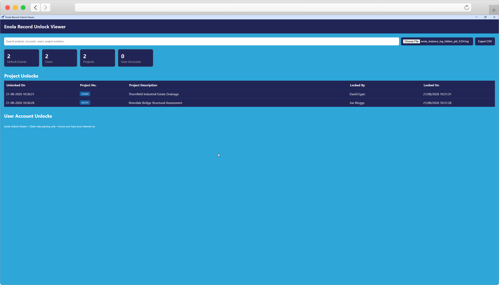
</p>
💡 **Tip:** Click the image for the full-size version.


---
[Back to top](#enterprise-project)
<a id="screenshots-project-navigator--enola"></a>
## 🖼️ Screenshots Project Navigator & Enola


<h3>New User Registration & Login</h3>

<p align="left">
  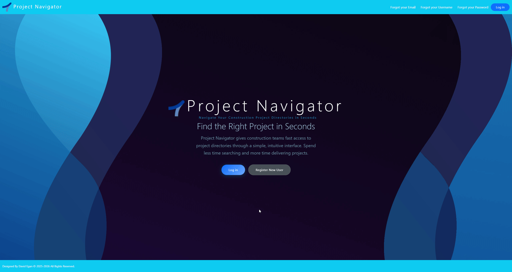
  
</p>

<h3>Account Recovery Email Retrieval & Username Retrieval</h3>

<p align="left">
  
  
</p>

<h3>Account Recovery Reset Password & Change Password</h3>

<p align="left">
  
  
</p>


<h3>Search all Projects & Search Projects to Modify</h3>

<p align="left">
  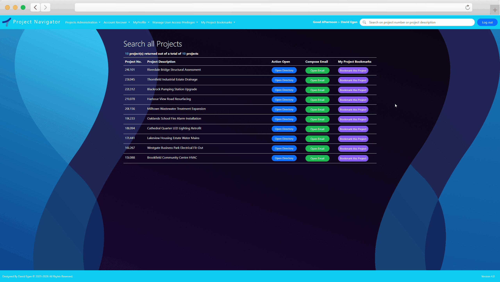
  
</p>

<h3>Edit MyProfile & Create New Project Entry</h3>
<p align="left">

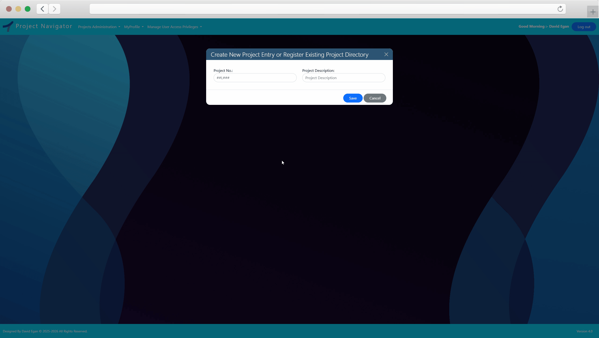
</p>

<h3>Search Users to Modify Access Privileges & Grant/Revoke User Privileges</h3>
<p align="left">
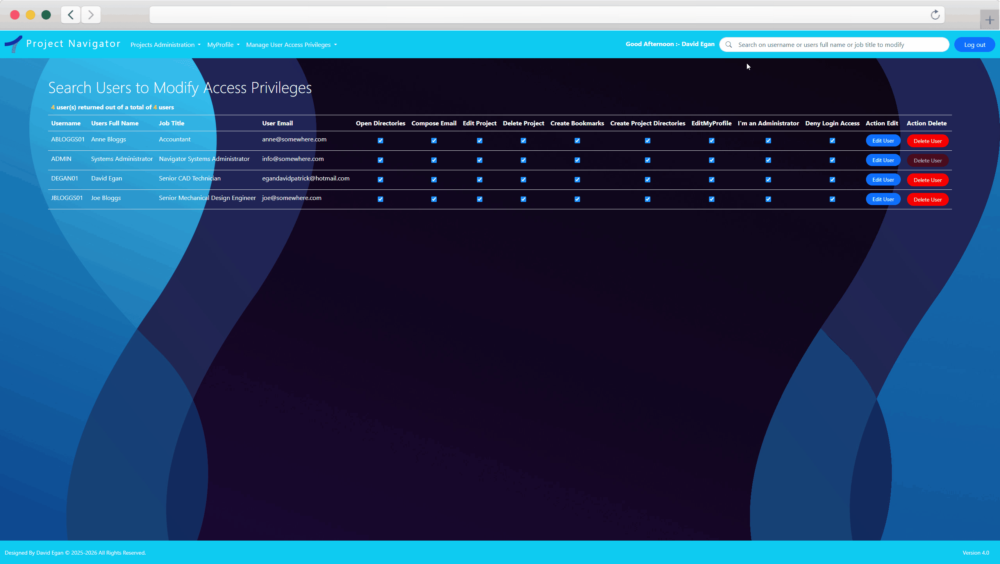
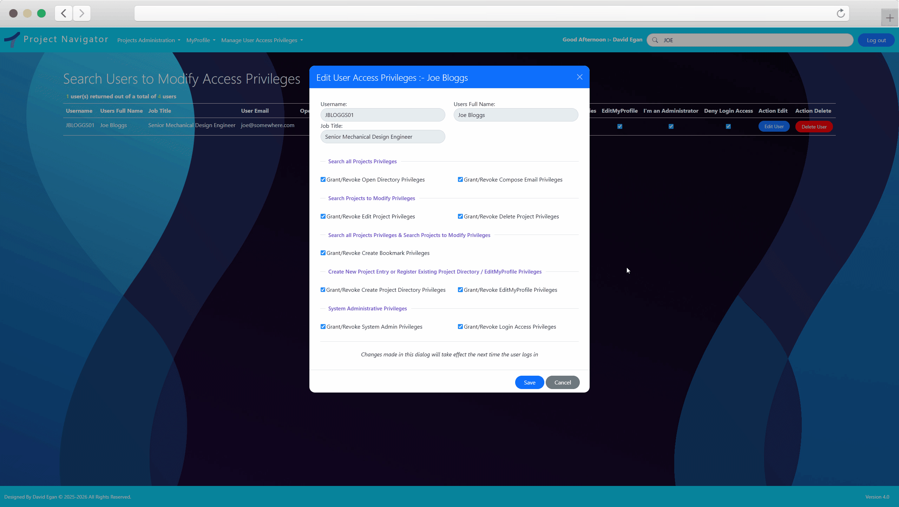
</p>

<h3>Project in use Notification & User account in use Notification</h3>

<p align="left">
  
  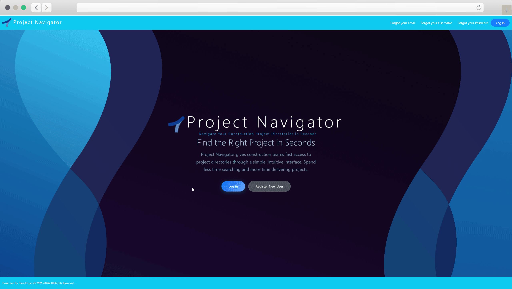
</p>
💡 **Tip:** Click the image for the full-size version.

---

<h3>Enola :- Server is running & Enola :- Server is stopped</h3>

<p align="left">
  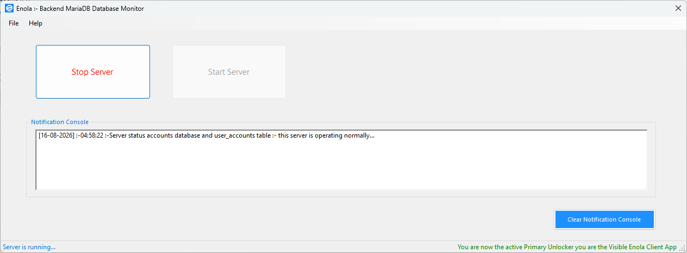
  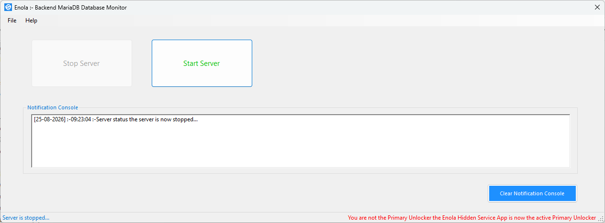
</p>


<h3>Enola :- About & Enola :- Server is running</h3>

<p align="left">
  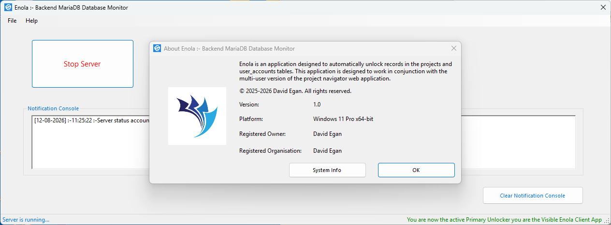
  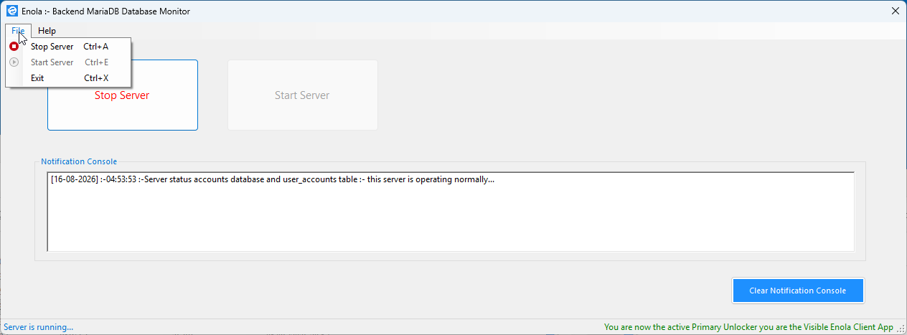
</p>

<h3>Enola :- Server is stopped & Enola :- Only one enola client instance allowed to run</h3>

<p align="left">
  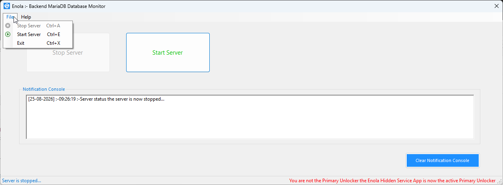
  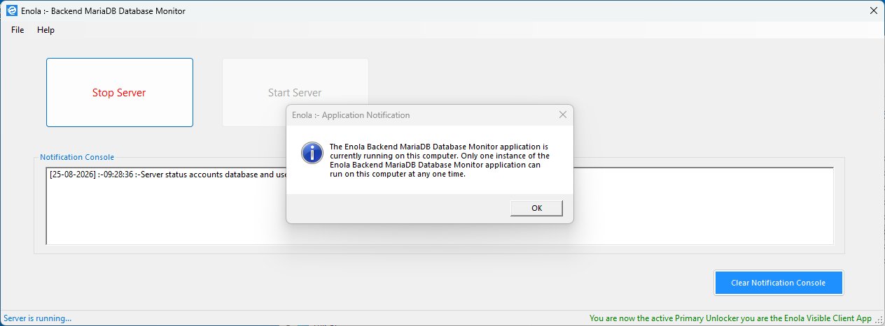
</p>
💡 **Tip:** Click the image for the full-size version.

---


<a id="solution"></a>
[Back to top](#enterprise-project)
## 💡 Solution

The Project Navigator centralises historical and active construction project information into a structured, searchable directory environment where project records can be located in seconds—eliminating manual directory navigation, reducing search time, and improving access to construction knowledge.

The platform provides a shared catalogue of project information across the organisation, enabling AEC teams to:

- Quickly retrieve historical and current project records
- Access project information through a structured search environment
- Improve visibility of engineering projects across departments
- Increase accessibility to organisational knowledge and technical records
- Reduce time spent locating engineering documentation and project assets
- Bookmark and quickly access frequently used projects

By consolidating project directory information into a unified catalogue system, the solution improves efficiency, strengthens knowledge retention, and supports faster access to the information required for construction decision-making.


---
[Back to top](#enterprise-project)
<a id="who-is-it-for"></a>
## 👥 Who Is It For?

Designed for AEC organisations managing multi-user engineering workflows involving:

* Project Managers
* Architects
* Engineers
* BIM Information Managers
* BIM Coordinators
* BIM Technicians
* CAD Technicians
* Consultants
* Contractors
* Document Controllers

---
[Back to top](#enterprise-project)
<a id="why-is-it-better-than-traditional-workflows"></a>
## 🚀 Why Is It Better Than Traditional Workflows?

Instead of relying on disconnected directories, emails, spreadsheets, and local copies, the platform provides a centralised network-accessible project catalogue where all users operate from the same shared directory structure and project data.

This reduces time spent searching for project directories, improves coordination across teams, and ensures construction information remains:

- Accessible
- Structured
- Consistently available
- Shared across all users

---
[Back to top](#enterprise-project)
<a id="operational-infrastructure"></a>
## ⚙️ Operational Infrastructure

**Development and Test Environment**

- Developed and tested on Windows 11 Pro using XAMPP, Apache, PHP, MariaDB and Visual Studio 2022.

**Software Requirements**
- XAMPP
- Apache 
- MariaDB Database
  
**Network Requirements**
- Internet connection

---
[Back to top](#enterprise-project)
<a id="live-demo"></a>
## 🔴 Live Demo

[Project Navigator Search all Projects Demo](https://youtu.be/Vg66_TL9fbM)

[Enola Asynchronous Record Unlocking Client Demo](https://youtu.be/aePvmlm38h4)

---
[Back to top](#enterprise-project)
<a id="results"></a>
## 📊 Results

- Eliminated manual searching through large project directory structures.
- Centralised project discovery into a searchable multi-user platform.
- Reduced the risk of conflicting edits through record locking.
- Automatically recovers abandoned locks without administrator intervention.
- Maintains lock-recovery availability through primary/backup failover.
- Provides controlled access through authentication and role-based administration.
- Keeps project data and infrastructure within the organisation's on-premises environment.

[Back to top](#enterprise-project)
<a id="project-status"></a>
## 🚦 Project Status

✅ Completed Project  

---
[Back to top](#enterprise-project)
<a id="author"></a>
## 👤 Author

David Egan

Sole Software Developer, Systems Designer, and Solutions Architect for the Multi-User Project Navigator Platform

<a href="https://www.linkedin.com/in/davidpatrickegan">LinkedIn</a> 
